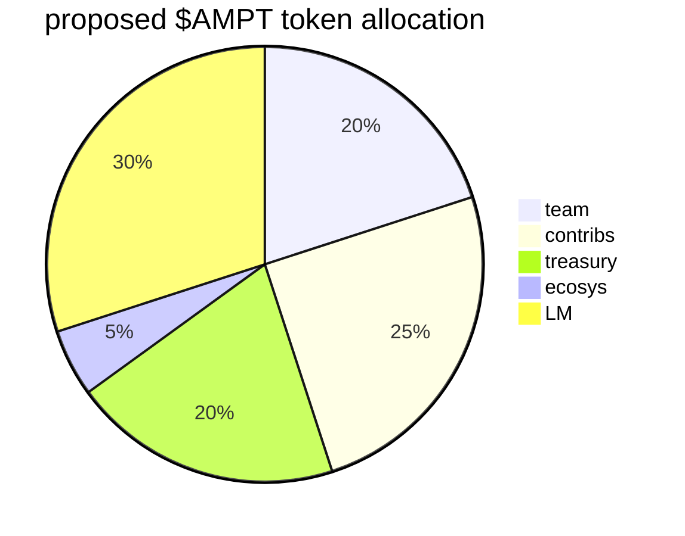

# Liquidity Mining & Governance

## Functional requirements

### The $AMPT token
-    the $AMPT token should be mintable.
-    the $AMPT token should be use the ERC-20 interface.
-    the $AMPT token contract should be owned by a smart contract, either the distributor of the Liquidity Mining rewards, or a higher-level distributor of the whole supply (including Liquidity Mining rewards).

### The Governance
-    The admin functions of the protocol shall be executed by a multi-sig, with 3 members from the founding team. Transactions should happen when 2 of the 3 members sign them.
-    The admin address shall be writable.
-    The multi-sig should be expandable, so eventually 3/5 and 5/7 configurations can be used.
-    The governance shall support off-chain voting.
-    The voting power token shall be $AMPT in the voting escrow (`veAMPT`)
-    The governance shall have a proposal mechanism, so proposals can be sponsored, and proposals by different sponsors can be labelled.
-    Proposals from the multi-sig members or their proxy designates shall be labelled as `core`
-    Proposals by the community members with at least 1% of the supply shall be labelled `community`
-    Proposals who do not meet the `core` or `community` criteria shall be blocked.

### Treasury and other Funds

-    The multi-sig shall control an on-chain Treasury, as well as other on-chain "Funds", which are wallets controlled by the multi-sig.
-    The $AMPT token can support a complete pre-mint. Alternatively, on each mint, a proxy contract can allocate tokens to each fund according to their function.
-    Funds under the control of the multi-sig:
     -    **the Treasury**: directly controlled by the multi-sig, can be pre-minted; total on Genesis: `20,000,000 $AMPT`
     -    **the Ecosystem Fund**: indirectly controlled by the multi-sig (separate wallet from Treasury), can be pre-minted; total on Genesis: `5,000,000 $AMPT`
     -    **the Contributor Mining Fund**: indirectly controlled by the multi-sig (separate wallet from Treasury), can be pre-minted. On each distribution, the grant will go to a payment streaming contract or service (i.e. Sablier) which will stream the $AMPT for 1 year (or reverse the streaming on multi-sig's call); total on Genesis: `25,000,000 $AMPT`
     -    **The Team Fund**: indirecty controlled by the multi-sig (separate wallet from Treasury), can be pre-minted. On each distribution, the grand will go to a locker contract (reversible on multi-sig's call), the locker will release the tokens after a year to a payment streaming contract or service (i.e. Sablier) which will stream the $AMPT for 3 years (or reverse the streaming on multi-sig's call); total on Genesis: `20,000,000 $AMPT`
     -    **The Liquidity Mining**: controlled by the distributor of the Liquidity Mining rewards, the multi-sig can configure the speed of distribution and the pools/markets or staking contracts the LM rewards can be distributed to. Can be pre-minted, but preferably it is minted on withdrawal by stakers (e.g. Compound rewards contract or MasterChef contract); total on Genesis: `35,000,000 $AMPT` (if pre-minted).

### Launch-related mechisms

#### Amplify 1.0
-    Amplify 1.0 LM rewards cannot be withdrawn from the protocols until the multi-sig calls an unlocking function.
-    Amplify 1.0 LM rewards shall accrue as normal, and balances for individual stakers shall be able to be queried in the smart contracts as well as readable in the official Amplify GUI.
-    Only Amplify 1.0 LM rewards ($AMPT) are locked, the user's balances for deposits including earned interest and other functionality like repaying debts and releasing collateral shall not be affected, only the $AMPT component of rewards cannot be withdrawn unless the blockage has been removed by governance.

#### Public sale support

Public sale will be done via a Balancer [Liquidity Bootstrapping Pool (LBP)][3]. 
-    pool has a template made by Balancer team.
-    initialization scripts are needed in order to run the LBP event, (see [the LBP docs][3]).
-    pricing and weightage parameters of LBP have to be set up later, as from business case they're dependent on private sale (manual, off-chain) outcome.
-    after LBP event is concluded, tokens from Amplify 1.0 will be unlocked.
-    ideally, Amplify 2.0 will be ready for release by the time the LBP launchs; so when LBP concludes, migration can start.

##### post-LBP $AMPT incentivized DEX pool
Immediately after LBP, liquidity for trading $AMPT will be incentivized
-    take 15% of LM allocations, and stream them to a staking vault contract.
     -    the deposit token of the staking contract shall be $AMPT / $ETH LP token from Uniswap, SushiSwap, or Balancer (need to further refine this).
     -    the vault will expect to receive $AMTP emissions. Every block, the vault will calculate the balance due to every staker, based on his percentage of the deposits that block. 
     -    the rewards accumulated are claimable, can be withdrawn by using a `claim()` or `harvest()` function without withdrawing the stake. The user pays the gas.
     -    on deposit/withdrawal, claiming is done automatically.
     -    consider taking the Synthetix staking rewards contract ([`StakingRewards.sol`][1]) as the base.
          -    an alternative is the Radix staking rewards contract ([`RewardPool.sol`][4]) which contains multipliers (up to 6x) for those staying in the pool longer, tracking every deposit for multiplier rather than every wallet to avoid gaming the system.

#### Migration support and rewards

Liquidity will be encouraged to migrate from Amplify 1.0 to Amplify 2.0.
- liquidity incentives should be turned off on Amplify 1.0
- convenience functions for lenders to migrate should be deployed for every supported asset both in v1 and v2 (i.e. migrate DAI in lending from v1 to v2).
- users who use the convenience functions should receive a reward, of $AMPT deposited in their wallets.

### Buyback mechanism

A mechanism for buybacks will be implemented for whenever protocol fees exceed a certain amount (decided by governance), the multi-sig can execute buybacks.
- a Balancer Smart Treasury is deployed, a [template by Balancer][5] is available.
- the Smart Treasury should be configured such that it contains two assets $ETH and $AMPT. The $ETH weightage should be 20%, the $AMPT weightage 80%.
- the Smart Treasury should be a private pool, only whitelisted addresses can add/withdraw liquidity.
- the Smart Treasury's only Whitelisted LP should be the multi-sig address.
- set the Smart Treasury fees at 10% of each swap. Swapping is on by default.

:::info
To execute a buyback, the multi-sig will simply send some $ETH to the Smart Treasury address, which will sell it for $AMPT until the weights match 20ETH-80AMPT again. Arbitrageurs will make sure the price impact is distributed across all markets.
:::

### Insurance and Governance staking mechanism

#### AMPT vote-locking
A mechanism analogous to [Curve's CRV -> veCRV vote-locking with boosts][6].
-    the user deposits $AMPT into a voting escrow and receives $veAMPT (voting escrow $AMPT) accoring to a formula (see [`VotingEscrow.vy`][11] for details).
     -    1 $AMPT vote-locked for approx. 4 years (208 weeks) equals 1 $veAMPT
     -    1 $AMPT vote-locked for less than 4 years receives a directly proportional amount of $veAMPT
     -    the minimum locking period is 1 week. Only increments in weeks are possible (1 week, 2 weeks, 3 weeks, etc)
     -    $veAMPT is non-tradeable (non-ERC20).
     -    $veAMPT decreases linearly as the lock approaches expiry.
-    Additional $AMPT can be added to any lock without changing its expiry.
-    voting power for governance will be based on the balance of $veAMPT help by a user, so all on-chain and off-chain governance shall be moved towards $veAMPT as the "voting token".
-    a percentage of protocol fees, determined by governance, shall be sent to the DILL vote-locking contract (as $AMPT) to be claimed every week. Consider adapting a separate fee-sharing contract like [`FeeDistributor.vy`][10].
-    $veAMPT holders should vote on-chain for the allocation of the liquidity mining rewards to the different Amplify markets.
     -    consider adapting a contract like [`GaugeProxy.vy`][7] from Curve for the voting contract. This will need a contract like [`LiquidityGauge.vy`][8] and other ancillary contracts like [`GaugeController.vy`][9] to assign weights and direct rewards to the different markets. 
-    To offer boosted rewards, the relative balance of $veAMPT the user holds will be used to determine if the user gets a boost. $veAMPT lockers are eligible to up to 2.5x boost in the rate they receive $AMPT rewards (the formula is available on [§9.1.3 of the Curve docs][12]) from the Amplify markets.
-    Locks of $AMPT can be extended at any time.

#### Safety Module
The SM is a pseudo-insurance mechanism, inspired by [Aave's implementation of the same mechanism][13]
- the SM takes $AMPT as deposits.
- the SM receives part of the $AMPT LM emissions as *security incentives* (SI) and distributes it pro-rata to depositors. The SI is determined by governance.
- the SM also receives revenue-sharing and distributes it pro-rata to depositors, the percentage of revenue is determined by governance.
- the $AMPT deposited in the SM is represented by a tokenised share, say $smAMPT, which is tradeable.
- the $AMPT deposits are subject to a cooldown for withdrawal, together with the SI. This cooldown should be initialized to 7 days and subject to change by governance.
- the revenue-sharing rewards are claimable anytime, and not subject to the cooldown.
- in case of a *shortfall event* (SE) in the protocol, up to 30% (adjustable by governance) of the locked $AMPT (and SI) in the SM can be seized by the protocol to cover the shortfall. 
- The seized assets are auctioned. A "backstop module" also exists where users deposit $ETH or stablecoins, in order to automatically buy $AMPT at a pre-agreed price (set by governance) in case of an SE. The backstop module also receives SI (determined by governance) as incentives for their opporunity cost.
- The backstop module is part of the auction module. The auction module uses a Dutch auction system to sell the seized assets, prioritizing the backstop module in filling orders, which are also available on the open market. The proceeds from the auction are then sent to the insolvent market.
- Should the SM fail to cover the full extend of the SE, a secondary mechanism issues $AMPT and auctions it until the SE is covered. This mechanism is called *recovery issuance* (RI).
- The SM would also accept as deposits liquidity shares (programmable Balancer LP tokens (BPT) initialized to 80% $AMPT and 20% ETH), which the protocol controls in a private pool that can change pool weights as well as trading fees, in order to maximize liquidity depth.

#### Security deposit management

A security deposit is taken from each tokenizer, as determined by governance based on the tokenizer's risk level. The security deposit is put into a yield-earning vault and returned unless there is a default by the tokenizer.
- a special vault for security deposits will me made available, governance will whitelist authorized tokenizers to deposit.
- take $DAI as deposits.
- give a receipt token for security deposits to the tokenizer ($sdDAI)
- invest the $DAI from the deposits in the AMPT $DAI market (get $amptDAI)
- in order to withdraw the funds (and the interest), governance must whitelist the address. The withdrawing address will be removed from the whitelist after one withdrawal. 
- Should the tokenizer default, after a governance vote, the security deposit will be seized ($sdDAI recalled).

## Protocol revenues

The protocol will charge 2 types of fees. 
- loan origination fees (charged to borrowers from the loan amount)
    - a percentage of loan origination fees are sent to the Treasury, determined by governance
    - a percentage of loan origination fees are sent to the loss provision fund, determined by governance. These vary based on the credit risk of the loan.
- lending interest fees (charged to lenders per block)
    - a percentage of lending interest fees are sent to the Treasury, determined by governance
    - a percentage of lending interest fees are sent to the loss provision fund, determined by governance.

**Loss Provision Fund**
An on-chain vault controlled by governance, which is deposited in the SM. It receives a percentage of protocol fees.

The values will be initialized as follows:
- **loan origination fees**: 
    - to Treasury: 0.5%
    - to Loss Provision Fund:
        - low credit risk: 1%
        - medium credit risk: 1.5%
        - high credit risk: 2%
- **lending interest fees**:  
    - to Treasury: 0.25%
    - to Loss Provision Fund: 1%

[1]: https://github.com/Synthetixio/synthetix/blob/v2.41.0/contracts/StakingRewards.sol
[2]: https://www.placeholder.vc/blog/2020/9/17/stop-burning-tokens-buyback-and-make-instead
[3]: https://docs.balancer.finance/smart-contracts/smart-pools/liquidity-bootstrapping-faq
[4]: https://etherscan.io/address/0xDF191bFbdE2e3E178e3336E63C18DD20d537c421#code
[5]: https://docs.balancer.finance/guides/smart-pool-templates-gui/smart-treasury
[6]: https://resources.curve.fi/faq/vote-locking-boost
[7]: https://github.com/curvefi/curve-dao-contracts/blob/master/contracts/GaugeProxy.vy
[8]: https://github.com/curvefi/curve-dao-contracts/blob/master/contracts/gauges/LiquidityGaugeV2.vy
[9]: https://github.com/curvefi/curve-dao-contracts/blob/master/contracts/GaugeController.vy
[10]: https://github.com/curvefi/curve-dao-contracts/blob/master/contracts/FeeDistributor.vy
[11]: https://etherscan.io/address/0x5f3b5dfeb7b28cdbd7faba78963ee202a494e2a2#code
[12]: https://curve.readthedocs.io/_/downloads/en/latest/pdf/
[13]: https://docs.aave.com/aavenomics/safety-module
